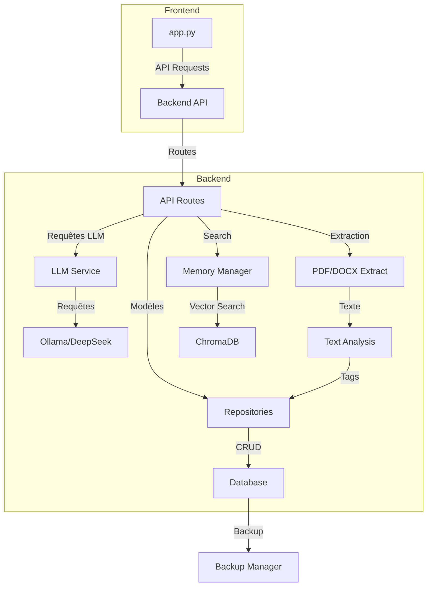

# Assistant de Rédaction de Mémoire Professionnel

Ce projet est un assistant d'IA pour aider à la rédaction de mémoires professionnels, en offrant des fonctionnalités de gestion de journal de bord, organisation de sections, recherche sémantique et intégration avec des modèles de langage.

## Architecture et Responsabilités

### Structure Détaillée du Projet

```
memoire-agent/
├── backend/                     # Serveur API FastAPI
│   ├── api/                     # Définitions API (routes, modèles)
│   │   ├── dependencies.py      # Dépendances FastAPI
│   │   ├── hallucination.py     # Fonctions pour la détection d'hallucinations
│   │   ├── models/              # Modèles Pydantic pour API
│   │   │   ├── admin.py         # Modèles admin et maintenance
│   │   │   ├── ai.py            # Modèles pour l'IA et génération
│   │   │   ├── base.py          # Modèles de base partagés
│   │   │   ├── export.py        # Modèles d'exportation
│   │   │   ├── hallucination.py # Modèles détection d'hallucinations
│   │   │   ├── journal.py       # Modèles pour journal de bord
│   │   │   └── memoire.py       # Modèles pour sections du mémoire
│   │   ├── routes/              # Endpoints API
│   │   │   ├── admin.py         # Routes administratives
│   │   │   ├── ai.py            # Routes IA et génération
│   │   │   ├── export.py        # Routes d'exportation
│   │   │   ├── hallucination.py # Routes détection d'hallucinations
│   │   │   ├── journal.py       # Routes pour journal de bord
│   │   │   ├── memoire.py       # Routes pour le mémoire
│   │   │   └── search.py        # Routes de recherche
│   │   └── utils/               # Utilitaires API
│   │       └── text_analysis.py # Analyse des textes API
│   ├── core/                    # Composants centraux
│   │   ├── config.py            # Configuration application
│   │   ├── dummy_vectordb.py    # Fallback ChromaDB
│   │   ├── exceptions.py        # Exceptions personnalisées
│   │   ├── logging.py           # Configuration logs centrale
│   │   ├── logging_config.py    # Configuration logs avancée
│   │   └── memory_manager.py    # Gestion de la mémoire vectorielle
│   ├── data/                    # Données persistantes
│   │   ├── memoire.db           # Base de données SQLite
│   │   └── vectordb/            # Données vectorielles (ChromaDB)
│   ├── db/                      # Couche d'accès aux données
│   │   ├── database.py          # Gestionnaire de connexion BD
│   │   ├── models/              # Modèles de données
│   │   │   └── db_models.py     # Définitions des modèles SQL
│   │   └── repositories/        # Repositories (pattern DAO)
│   │       ├── guidelines_repository.py # Repository pour consignes
│   │       ├── journal_repository.py    # Repository pour journal
│   │       └── memoire_repository.py    # Repository pour mémoire
│   ├── deepseek_orchestrator.py # Intégration DeepSeek API
│   ├── diagnose_ollama.py       # Diagnostic de l'API Ollama
│   ├── hallucination_detector.py # Détection d'hallucinations
│   ├── llm_orchestrator.py      # Orchestrateur d'interactions LLM
│   ├── logs/                    # Journaux application backend
│   ├── main.py                  # Point d'entrée principal FastAPI
│   ├── requirements.txt         # Dépendances backend
│   ├── scripts/                 # Scripts utilitaires
│   │   ├── init.sh              # Initialisation environnement
│   │   └── run_tests.sh         # Exécution des tests
│   ├── services/                # Services métier
│   │   ├── export_service.py    # Service d'exportation
│   │   ├── llm_service.py       # Service IA/LLM
│   │   ├── memory_manager.py    # Gestionnaire mémoire
│   │   └── memory_service.py    # Service mémoire
│   ├── tests/                   # Tests automatisés
│   │   ├── conftest.py          # Configuration de test
│   │   ├── test_api/            # Tests des API
│   │   ├── test_db/             # Tests de la base de données
│   │   ├── test_services/       # Tests des services
│   │   └── test_utils/          # Tests des utilitaires
│   └── utils/                   # Utilitaires Backend
│       ├── circuit_breaker.py   # Protection contre pannes
│       ├── pdf_extractor.py     # Extraction de texte PDF/DOCX
│       ├── text_analysis.py     # Analyse textuelle
│       └── text_processing.py   # Traitement de texte
├── frontend/                    # Interface utilisateur Streamlit
│   ├── app.py                   # Application Streamlit principale
│   ├── data/                    # Données frontend
│   ├── logs/                    # Journaux frontend
│   ├── requirements.txt         # Dépendances frontend
│   └── utils/                   # Utilitaires frontend
│       └── logging_config.py    # Configuration logging frontend
├── backups/                     # Sauvegardes automatiques
├── contexts/                    # Contextes de conversation
├── deepseek_api_doc/            # Documentation API DeepSeek
├── docker-compose.yml           # Configuration Docker
├── logs/                        # Journaux principaux
├── poetry.lock                  # Verrouillage des versions (poetry)
├── pyproject.toml               # Configuration du projet
└── pytest.ini                   # Configuration des tests pytest
```

### Flux de Données et Interactions



### Composants Principaux

#### Backend

- **main.py**: Point d'entrée du serveur backend FastAPI
  - Initialise l'API, la base de données et les routes
  - Configure le middleware CORS
  - Expose les endpoints principaux

- **api/routes/**: Définition des endpoints API
  - **journal.py**: Routes pour la gestion du journal de bord
  - **memoire.py**: Routes pour la gestion du mémoire
  - **search.py**: Routes pour la recherche sémantique
  - **ai.py**: Routes pour l'intégration des LLM
  - **export.py**: Routes pour l'exportation de contenu
  - **hallucination.py**: Routes pour la détection d'hallucinations
  - **admin.py**: Routes administratives (cleanup, maintenance)

- **db/repositories/**: Accès aux données (pattern Repository)
  - **journal_repository.py**: Opérations CRUD pour entrées journal
  - **memoire_repository.py**: Opérations CRUD pour sections mémoire
  - **guidelines_repository.py**: Opérations pour les consignes du mémoire

- **services/**: Logique métier
  - **memory_service.py**: Service de gestion des entrées et sections
  - **llm_service.py**: Service d'intégration avec modèles LLM
  - **export_service.py**: Génération de documents exportables

- **utils/**: Fonctions utilitaires
  - **text_processing.py**: Traitement de texte et NLP
  - **pdf_extractor.py**: Extraction de contenu depuis PDFs/DOCXs
    - Responsable de l'extraction de dates et tags
  - **text_analysis.py**: Analyse de texte (extraction d'entités, etc.)
  - **circuit_breaker.py**: Protection contre les pannes externes

#### Frontend

- **app.py**: Application Streamlit principale
  - Définit toutes les pages et visualisations
  - Gère l'affichage du tableau de bord, journal, mémoire
  - Coordonne les interactions avec l'API backend

### Mécanismes Clés et Flux de Travail

1. **Importation de Documents**:
   - L'utilisateur télécharge un document PDF/DOCX via l'interface Streamlit
   - Le frontend envoie le fichier à l'API backend (POST /journal/import/document)
   - `pdf_extractor.py` traite le document pour extraire:
     - Texte (via PyPDF2/pdfminer.six pour PDFs, python-docx pour DOCX)
     - Date (extraction intelligente du nom de fichier ou contenu)
     - Tags (analyse du contenu via `text_analysis.py`)
   - Les entrées extraites sont enregistrées dans la base de données SQLite
   - Les données sont également indexées dans ChromaDB pour recherche vectorielle

2. **Génération de contenu**:
   - L'utilisateur demande la génération de contenu pour une section
   - L'API communique avec le service LLM (Ollama ou DeepSeek)
   - Les entrées pertinentes sont extraites comme contexte
   - Le LLM génère du contenu basé sur ce contexte
   - Le contenu est vérifié pour les hallucinations
   - Le résultat est enregistré dans la base de données

3. **Système de Backup**:
   - Sauvegarde automatique des données et sessions
   - Protection contre la perte de données
   - Possibilité de restaurer des versions précédentes

## Configuration

### Variables d'environnement

- `USE_DUMMY_LLM=true` : Active le mode simulé pour les LLM (quand Ollama n'est pas disponible)
- `OLLAMA_HOST=http://localhost:11434` : URL d'Ollama (par défaut localhost:11434)
- `OLLAMA_MODEL=mistral:7b` : Modèle LLM par défaut
- `LOG_LEVEL` : Niveau de log (DEBUG, INFO, WARNING, ERROR). Par défaut : INFO
- `LOG_FILE` : Chemin du fichier de log. Configuration optionnelle, par défaut dans le dossier `logs`

## Démarrage de l'application

1. Backend:
```bash
cd backend
python main.py
```

2. Frontend:
```bash
cd frontend
streamlit run app.py
```

## Fonctionnalités

### Système de logging amélioré

L'application dispose d'un système de logging amélioré utilisant Rich et Loguru pour une meilleure expérience de débogage :

- Logs colorés et formatés dans la console
- Tracebacks améliorés pour faciliter l'identification des erreurs
- Rotation des fichiers de logs par date/heure
- Configuration unifiée entre backend et frontend

Pour plus de détails, consultez le fichier [LOGGING.md](LOGGING.md).

### Intégration avec Ollama

L'application peut utiliser Ollama pour les fonctionnalités d'IA. Voir [OLLAMA.md](OLLAMA.md) pour plus de détails sur la configuration et l'utilisation.

## Roadmap

### Phase 1: Fondations (Actuel)
- ✅ Journal de bord avec importation de documents
- ✅ Extraction automatique de dates et tags
- ✅ Tableau de bord avec visualisations
- ✅ Système de sauvegarde automatique
- ✅ Intégration LLM basique avec Ollama

### Phase 2: Rédaction Assistée (En cours)
- 🔄 Génération de suggestions de sections du mémoire
- 🔄 Rédaction assistée par IA de paragraphes
- ⬜ Détection avancée d'hallucinations
- ⬜ Analyses de sentiment et thématiques des entrées journal

### Phase 3: Collaboration et Production (Planifié)
- ⬜ Exportation vers différents formats (Word, PDF, Markdown)
- ⬜ Collaboration multi-utilisateurs
- ⬜ Suggestions automatiques de citations et références
- ⬜ Visualisations avancées de progression
- ⬜ Intégration d'un correcteur orthographique et grammatical

### Phase 4: Intelligence Avancée (Vision)
- ⬜ Réponses contextuelles basées sur l'ensemble du mémoire
- ⬜ Suggestions de restructuration basées sur la cohérence
- ⬜ Analyse comparative avec d'autres mémoires (anonymisés)
- ⬜ Détection de plagiats et suggestions d'originalité

## Résolution des problèmes

### Problème de thread SQLite
Si vous rencontrez l'erreur "SQLite objects created in a thread can only be used in that same thread", le code a été modifié pour utiliser `check_same_thread=False`.

### Tables manquantes
Si vous rencontrez des erreurs "no such table", les définitions des tables manquantes ont été ajoutées au processus d'initialisation de la base de données.

### Erreurs 404
Les erreurs 404 sont normales si vous n'avez pas encore ajouté de contenu (entrées de journal, sections de mémoire, etc.).

### Problèmes connus avec les tags
Si vous rencontrez des problèmes avec l'affichage des tags ou des erreurs JavaScript dans le tableau de bord, utilisez les outils de nettoyage:
- Route API: `/admin/cleanup/orphan-tags` pour supprimer les tags orphelins
- Route API: `/admin/cleanup/import-tags` pour supprimer les tags liés aux imports

### Logs
Si vous rencontrez des problèmes, consultez les logs dans les répertoires suivants :
- Backend : `backend/logs/`
- Frontend : `frontend/logs/`

La page "Diagnostic" de l'interface Streamlit permet également de visualiser les logs récents.